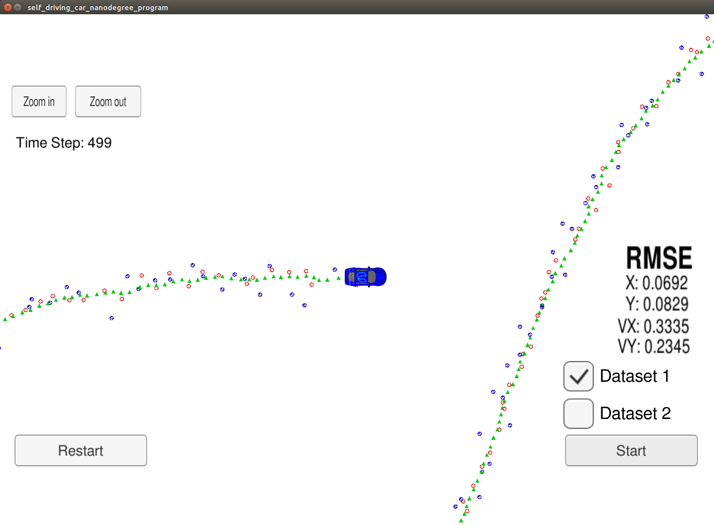

# UnscentedKalmanFilterSDCN
Unscented Kalman Filter (UKF) implementation for Udacity Self Driving Car Nanodegree

### Overview
This repository contains implementation of an Unscented Kalman filter for estimating the location of a moving vehicle with noisy lidar and radar measurements. The performance of the filter can be visualized by using the simulator provided by Udacity. 

### Data file 
The data file is provided by Udacity and contains the lidar and radar measurements in a text format. This file is the same as in the Extended Kalman Filter project (see the corresponding [repository](https://github.com/bmalnar/ExtendedKalmanFilterSDCN)). The screenshot of the portion of the file can be seen in the following picture:


As explained on the Udacity's project github, each row represents a sensor measurement where the first column tells you if the measurement comes from radar (R) or lidar (L). For a row containing radar data, the columns are: **sensor_type, rho_measured, phi_measured, rhodot_measured, timestamp, x_groundtruth, y_groundtruth, vx_groundtruth, vy_groundtruth, yaw_groundtruth, yawrate_groundtruth**. For a row containing lidar data, the columns are: **sensor_type, x_measured, y_measured, timestamp, x_groundtruth, y_groundtruth, vx_groundtruth, vy_groundtruth, yaw_groundtruth, yawrate_groundtruth**.

The Kalman filter that is programmed in this project estimates the state vector of the moving vehicle, which has the format (px, py, vx, vy). For each data point, we store the ground truth and the Kalman filter estimation, so that we can calculate the root mean square error (RMSE) for the entire trajectory of the vehicle. The goal is to have RMSE less or equal to (.09, .10, 0.40, 0.30) for each of the values in the state vector (px, py, vx, vy). This values are lower than the threshold values in the EKF project, because with UKF we use a more detailed motion model and UKF can also handle non-linearities better than EKF - hence we expect better accuracy from UKF.  

### C++ source files
We have the following C++ source files in the _src_ directory of the repository:

- main.cpp - This file is used without modifications from the original Udacity repositry. The file reads in sensor data line by line and invokes the Kalman filter for estimations of the vehicle's position. It also stores the data for the ground truth, and makes sure that the RMSE values are displayed in the simulator in each step.  
- ukf.cpp - This file contains the code that processes individual measurements. For the first measurement, it initializes the UKF with the matrices needed for computation (covariance matrix, state transition, measurement function, noise). For the subsequent measurements (after the first measurement), it calls the predict and update steps of the Kalman filter and displays the current state vector and the uncertainty after that measurement is processed. 
- tools.cpp - This file contains helper functions for printing debug messages, for calculating the Jacobian matrix, the radar function, and the RMSE value in each step. 

### Output from the program
The output of the program is monitored in the simulator screen. On the right hand side of that screen, we can monitor RMSE values for x, y, vx and vy, which are calculated and immediately displayed for each measurement in the program. If the UKF works correctly, we should see the RMSE values typically decreasing with each step. The following image shows the screenshot of the simulator at the end of the run. We observe the RMSE values to be **(0.0692, 0.0829, 0.3335, 0.2345)**, meaning that the goal of the project, as described above, is met. 


 
### How to run the program
After cloning this repository, simply execute the following commands to build and run the program:
```
mkdir build
cd build
cmake ..
make
./UnscentedKF
```
At the same time, the Udacity simulator needs to be running, so that the simulator and the UKF program connect and exchange information. 

### Setting up the environment 
- The project is configured to compile with cmake and make. Please make sure that the following dependencies are met:
   - cmake version 3.5
   - make version 4.1 for Linux and Mac and 3.81 for Windows
   - gcc/g++ version 5.4
- Download the Udacity simulator from [here](https://github.com/udacity/self-driving-car-sim/releases/)
- Additional libraries need to be installed by running:
   - On Ubuntu, install-ubuntu.sh 
   - On Mac, install-mac.sh
   - On Windows, the recommended way is to run a virtual machine and use the install-ubuntu.sh script
   
### More information
For even more information on the project structure, dependencies etc. please check original Udacity project [repository](https://github.com/udacity/CarND-Unscented-Kalman-Filter-Project)

